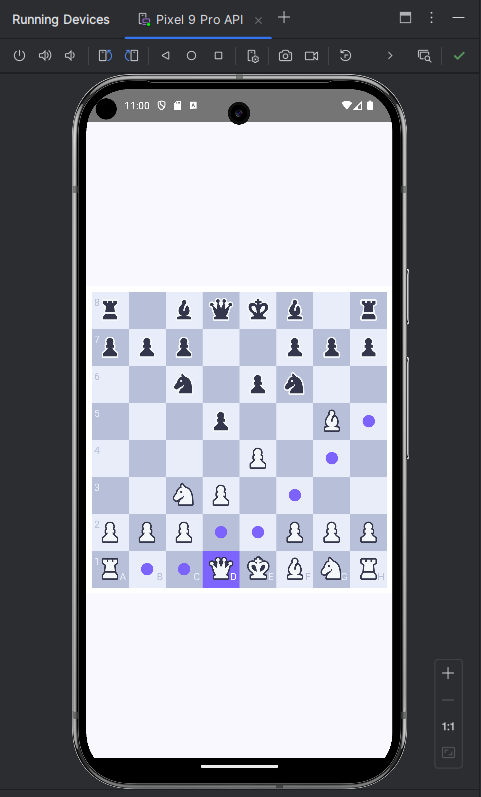

## Android ChessApp

For now, I have implemented the fundamentals:

- basic movement rules for all pieces (straight/diagonal)
- movement restrictions and identify possible moves for each piece, based on the current game state
- player turn switching and move validation
- interactive chessboard UI, with drag-and-drop functionality for piece movement

Current progress:

TODO:

- logic for detecting check, checkmate, and stalemate
  - detect edge cases (insufficient material, threefold repetition, and fifty-move rule)
- display elapsed game time
- score panel indicating captured pieces for each side
- 'Home Screen' for navigating game options
  - connect screens for In-Game play and Previous Games history

The project looks fun, so after implementing the fundamentals I might try to:

- add online multiplayer integration with matchmaking (link sharing?)
- integrate a basic AI for single-player mode (easy, medium, and hard difficulty)
