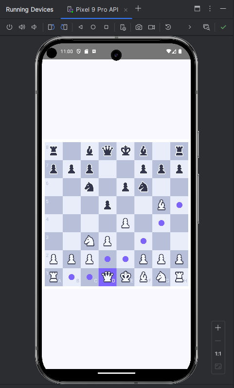

# '75 Leetcode'

Practicing hackerrank type of questions in Python.  
Need some place to keep myself accountable and track my progress.  

## 'Android-ChessApp'

Preparing for an Android developer interview, so I will practice & revise with some small Java/Kotlin projects.  
I have(had) a week to prepare. 
Developed a small chess app (using Kotlin), I have implemented the fundamentals:
  - basic movement rules for all pieces (straight/diagonal)
  - movement restrictions and identify possible moves for each piece, based on the current game state
  - player turn switching and move validation
  - interactive chessboard UI, with drag-and-drop functionality for piece movement

potential TODO list:
- logic for detecting check, checkmate, and stalemate
  - detect edge cases (insufficient material, threefold repetition, and fifty-move rule)
- display elapsed game time
- score panel indicating captured pieces for each side
- 'Home Screen' for navigating game options
  - connect screens for In-Game play and Previous Games history

The project is much fun, I really enjoy working on mobile applications.
I plan a new project so I will start working on it soon.

## 'svg-colour-editor'

A friend of mine asked me if I could clear some colours from a .svg file. Had to research how it works, it is actually pretty straightforward.
Now I have a program that can remove colours from a .svg file and save the new file.
Fun exercise.